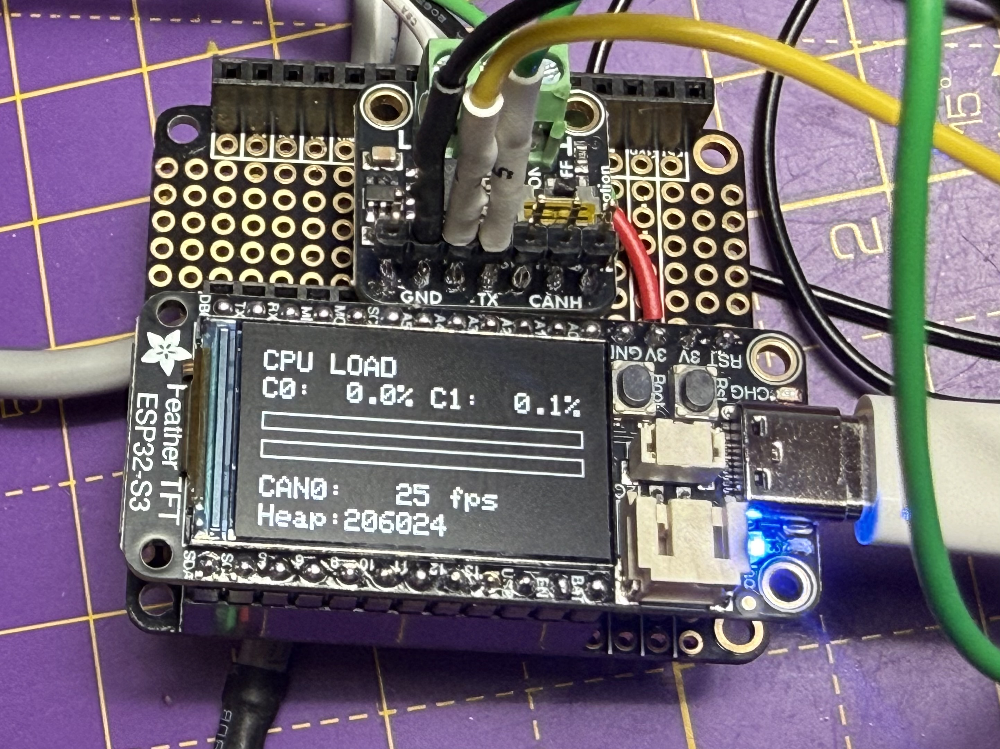

ESP32RET with Adafruit TFT
==========================

Reverse Engineering Tool running on ESP32 based hardware. Supports Adafruit ESP32-S3 TFT 

See main README.md for upstream repo.

#### Requirements:

You will need the following to be able to compile the run this project:

- [Arduino IDE](https://www.arduino.cc/en/Main/Software) Tested on 1.8.13
- [Arduino-ESP32](https://github.com/espressif/arduino-esp32) - Allows for programming the ESP32 with the Arduino IDE
- [esp32_can_adarfuit_tft](https://github.com/Purplemeanie/esp32_can_adafruit_tft.git) - A CAN library that supports the built-in CAN
- [esp32_mcp2517fd](https://github.com/collin80/esp32_mcp2517fd) - CAN library supporting MCP2517FD chips
- [can_common](https://github.com/collin80/can_common) - Common structures and functionality for CAN libraries

### LED Color Codes

The upstream project supports NeoPixles (FancyLEDs) with the following colour codes that weren't documented. So here they are.

- RED - Not connected (In WIFIMODE=2 you are creating an AP with the A0, so it will go green immediately because you're the AP)
- Green - Ready to connect to application 
- Blue - Connected to application
- Purple - Update mode 

### Purplemeanie Changes



Firstly, I had some ESP32-S3 TFT boards from Adafruit kicking around so thought I'd try them with an Adafruit CAN Pal as a CAN sniffer. So I added a new board setting for the Adafruit TFT (SYSTYPE=4).

All went well until I tried to put the sniffer on a bus with multple frame sources. At which point the board started to PANIC. After a lot of conversations with ChatGPT (so a lot of the changes were AI generated) it seemed that the problems were around task_CAN and task_LowLevelRx enable and disable. So some of the fundamental changes revolve around stabilizing the startup process. I've been quite defensive with these changes as I'd like to be able to use the second ESP32 core for some projects and so I've added a lot of mutexes, and probably need a lot more.

Secondly, I wanted to take advantage of the TFT display on the Adafruit board, so there's a bunch of changes around initializing the display and creating some graphics of CPU usage and CAN frame rates (though there are some hard coded assumptions about only having a single CANbus at the moment).

Finally, I added a sticky CONSOLECAN setting. It was already a serial command but wasn't saved between reboots. So I added that too.

### Building

This project, as it's currently configured, assumes it is being built on a Mac and under the PlatformIO plugin within Visual Studio Code. Given those caveats, it should be possible to just do Shift-Cmd-P and select PlatformIO: Upload and Monitor. 

Note that the platformio.ini requires the esp32_can_adafruit_tft to be at the same directory level as the ESP32RET directory - both at the same level.

### Grabbing a Coredump

For these two commands you'll need:

```
pipx install esptool
pipx install esp-coredump
```

```
pio pkg exec -p tool-esptoolpy -- esptool.py \
  --chip esp32s3 --port /dev/cu.usbmodemXXX --baud 921600 \
  read_flash 0x003F0000 0x00010000 coredump.bin
```

and processing it into something readable

```
esp-coredump info_corefile \
  -g ~/.platformio/packages/tool-xtensa-esp-elf-gdb/bin/xtensa-esp32s3-elf-gdb \
  -c coredump.bin -t raw \
  .pio/build/stable_adafruit_tft/firmware.elf
```

It is possible to get esp-coredump to pull the core as well, but I did it with the two commands.

#### License:

This software is MIT licensed:

Copyright (c) 2014-2026 Collin Kidder, Michael Neuweiler, John Martin

Permission is hereby granted, free of charge, to any person obtaining
a copy of this software and associated documentation files (the
"Software"), to deal in the Software without restriction, including
without limitation the rights to use, copy, modify, merge, publish,
distribute, sublicense, and/or sell copies of the Software, and to
permit persons to whom the Software is furnished to do so, subject to
the following conditions:

The above copyright notice and this permission notice shall be included
in all copies or substantial portions of the Software.

THE SOFTWARE IS PROVIDED "AS IS", WITHOUT WARRANTY OF ANY KIND,
EXPRESS OR IMPLIED, INCLUDING BUT NOT LIMITED TO THE WARRANTIES OF
MERCHANTABILITY, FITNESS FOR A PARTICULAR PURPOSE AND NONINFRINGEMENT.
IN NO EVENT SHALL THE AUTHORS OR COPYRIGHT HOLDERS BE LIABLE FOR ANY
CLAIM, DAMAGES OR OTHER LIABILITY, WHETHER IN AN ACTION OF CONTRACT,
TORT OR OTHERWISE, ARISING FROM, OUT OF OR IN CONNECTION WITH THE
SOFTWARE OR THE USE OR OTHER DEALINGS IN THE SOFTWARE.
